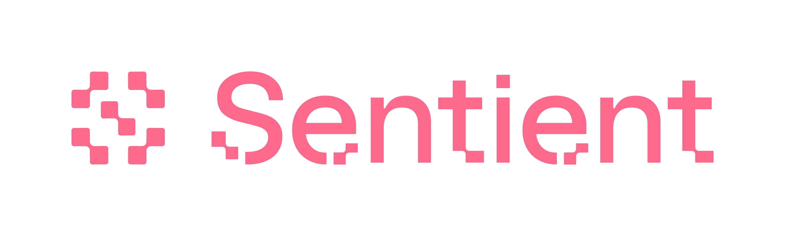
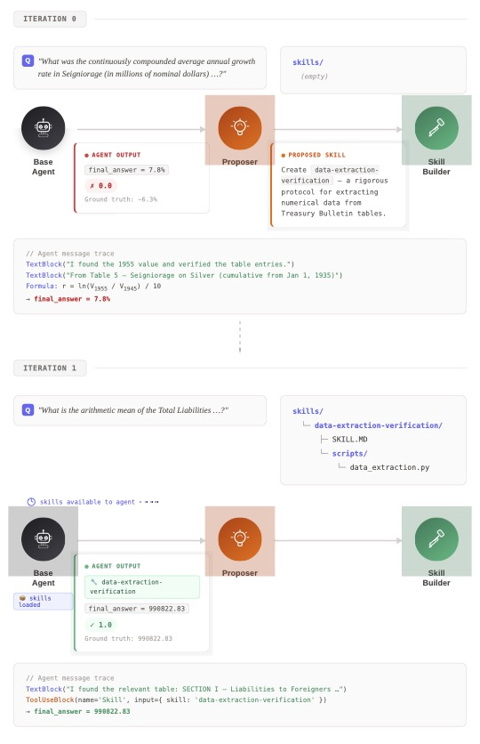

<div align="center">
    
    <h1>EvoSkill: Automated Skill discovery For Multi-Agent Systems</h1>
</div>

<p align="center">
  <strong>Automatically discover high-performance agent skills for any task!</strong>
</p>


<p align="center">
  <a href="https://sentient.xyz/" target="_blank" style="margin: 2px;">
    
  </a>
  <a href="https://github.com/sentient-agi" target="_blank" style="margin: 2px;">
    
  </a>
  <a href="https://huggingface.co/Sentientagi" target="_blank" style="margin: 2px;">
    
  </a>
</div>

<div align="center" style="line-height: 1;">
  <a href="https://discord.gg/sentientfoundation" target="_blank" style="margin: 2px;">
    
  </a>
  <a href="https://x.com/SentientAGI" target="_blank" style="margin: 2px;">
    
  </a>
</p>
<p align="center">
  <a href="https://www.sentient.xyz/blog/recursive-open-meta-agent">Paper (Preprint)</a> •
  <a href="https://www.sentient.xyz/">Build Agents for $$$</a>
</p>


</div>

## 📑 Table of Contents

- [🧠 What is EvoSkill?](#-what-is-evoskill)
- [🏗️ How It Works](#️-how-it-works)
- [📦 Installation & Setup](#-installation--setup)
- [⚡ Quickstart: Running the Self-Improvement Loop](#-quickstart-running-the-self-improvement-loop)
- [📊 Running Evaluations](#-running-evaluations)
- [🔑 Key Concepts](#-key-concepts)
- [🧩 Extending EvoSkill: Adding a New Task](#-extending-evoskill-adding-a-new-task)
- [📚 Citation](#-citation)
- [📄 License](#-license)

---

## 🧠 What is EvoSkill?

EvoSkill is a self-improving agent framework that **automatically discovers high-performance skills** for AI agents. Rather than relying on manual prompt engineering, EvoSkill runs an evolutionary loop that tests an agent on benchmark questions, identifies failure patterns, proposes improvements (new skills or prompt mutations), evaluates the changes, and keeps the best-performing variants.

The core insight is simple: treat agent configurations as programs that can be iterated on automatically. Each "program" is a versioned combination of a system prompt and a set of skills. EvoSkill maintains a **frontier** of the top-N performing programs, uses failures to drive targeted improvements, and tracks everything through git branches for full reproducibility.

EvoSkill has been validated on multiple benchmarks including DABStep (data analysis), SEAL-QA (search-augmented QA), and OfficeQA, demonstrating that automated skill discovery can match or exceed hand-tuned agent configurations.

---

## 🏗️ How It Works

<p align="center">
  
</p>

The self-improvement loop follows five stages:

1. **Base Agent** — Attempts benchmark questions using the current best program (system prompt + skills).
2. **Proposer** — Analyzes failure cases and proposes targeted skill or prompt changes to address them.
3. **Generator** — Creates the proposed changes: writes new skill files or rewrites the system prompt.
4. **Evaluator** — Scores the new program variant on a held-out validation set to measure improvement.
5. **Frontier** — Tracks the top-N performing programs as git branches; the best survive to the next iteration.

This cycle repeats for a configurable number of iterations, automatically converging on stronger agent configurations.

---

## 📦 Installation & Setup

**Requirements:**
- Python 3.12+
- [`uv`](https://github.com/astral-sh/uv) (recommended) or `pip`

**Install dependencies:**

```bash
# Using uv (recommended)
uv sync

# Or using pip
pip install -e .
```

**Environment variables:**

```bash
# Required — used by the Claude agent SDK
export ANTHROPIC_API_KEY=your-key-here
```

**Dataset preparation:**

Place your benchmark datasets in the `.dataset/` directory:
- DABStep: `.dataset/dabstep_data.csv`
- SEAL-QA: `.dataset/seal-0.csv`
- OfficeQA: see `scripts/run_eval.py` for expected path

---

## ⚡ Quickstart: Running the Self-Improvement Loop

Run the evolutionary skill discovery loop on a benchmark:

**DABStep:**

```bash
python scripts/run_loop.py --mode skill_only --max-iterations 20
```

**SEAL-QA:**

```bash
python scripts/run_loop_sealqa.py --mode skill_only --max-iterations 20
```

**Key CLI flags:**

| Flag | Description | Default |
|------|-------------|---------|
| `--mode` | Evolution mode: `skill_only` or `prompt_only` | `skill_only` |
| `--max-iterations` | Number of improvement iterations | `20` |
| `--frontier-size` | Number of top programs to keep | `3` |
| `--concurrency` | Concurrent evaluations | `4` |
| `--continue` | Resume from existing frontier | off |
| `--no-cache` | Disable run caching | off |
| `--model` | Base agent model (`opus`, `sonnet`, `haiku`) | `opus` |

---

## 📊 Running Evaluations

Evaluate an agent configuration on a full benchmark dataset:

**OfficeQA:**

```bash
python scripts/run_eval.py --model opus --max-concurrent 8
```

**DABStep:**

```bash
python scripts/run_eval_dabstep.py --model opus --max-concurrent 8
```

**SEAL-QA:**

```bash
python scripts/run_eval_sealqa.py --model opus --max-concurrent 8
```

Common eval flags: `--output <path>`, `--max-concurrent <n>`, `--num-samples <n>`, `--no-resume`.

---

## 🔑 Key Concepts

- **Program** — A versioned agent configuration (system prompt + skills), stored as a git branch.
- **Frontier** — The top-N highest-scoring programs, tracked via git tags and branches.
- **Evolution Mode** — `skill_only` discovers new reusable skills; `prompt_only` optimizes the system prompt directly.
- **Skill** — A reusable capability file written to `.claude/skills/` that the agent can invoke during execution.
- **Proposer** — Analyzes agent failures and suggests what skill or prompt change would help.
- **Generator** — Takes a proposal and produces the actual skill file or prompt rewrite.

---

## 🧩 Extending EvoSkill: Adding a New Task

EvoSkill is designed to be extended to new benchmarks. To add your own task, follow these four steps:

### 1. Create an Agent Profile

Add a new directory under `src/agent_profiles/` for your task:

```
src/agent_profiles/my_task_agent/
├── __init__.py
├── my_task_agent.py    # Options factory
└── prompt.txt          # (optional) task-specific system prompt
```

Your agent module should expose a `make_*_agent_options` factory that returns `ClaudeAgentOptions`. See `src/agent_profiles/dabstep_agent/dabstep_agent.py` or `src/agent_profiles/sealqa_agent/sealqa_agent.py` for reference.

Then register the exports in `src/agent_profiles/__init__.py`.

### 2. Create a Scorer

Add a scorer under `src/evaluation/` that compares the agent's output to ground truth:

```python
# src/evaluation/my_task_scorer.py

def score_my_task(predicted: str, ground_truth: str) -> bool:
    """Return True if the answer is correct."""
    return predicted.strip().lower() == ground_truth.strip().lower()
```

For more complex grading (e.g. partial credit or LLM-based judging), see `src/evaluation/sealqa_scorer.py`.

### 3. Create an Evaluation Script

Add a script under `scripts/` that loads your dataset and runs `evaluate_full()`:

```python
# scripts/run_eval_my_task.py

from src.agent_profiles import Agent, make_my_task_agent_options
from src.evaluation.eval_full import evaluate_full
from src.schemas import AgentResponse

agent = Agent(make_my_task_agent_options(model="opus"), AgentResponse)
results = await evaluate_full(agent=agent, items=items, output_path=output, ...)
```

See `scripts/run_eval_dabstep.py` for a complete example with argparse, dataset loading, and result reporting.

### 4. Create a Self-Improvement Loop Script (optional)

To run automated skill discovery on your task, add a loop script under `scripts/` following the pattern in `scripts/run_loop.py`. The key ingredients are:

- A **dataset split** function (train set for failure analysis, validation set for scoring)
- Your **agent options factory** and **scorer** wired into `SelfImprovingLoop`
- A `LoopConfig` with your chosen mode (`skill_only` or `prompt_only`)

---

## 📚 Citation

If you use EvoSkill in your research, please cite:

```bibtex
@software{al_zubi_2025_17052592,
  author       = {Alzubi, Salaheddin and},
  title        = {SentientResearchAgent: A Hierarchical AI Agent
                   Framework for Research and Analysis
                  },
  month        = sep,
  year         = 2025,
  publisher    = {Zenodo},
  version      = {ROMA},
  doi          = {10.5281/zenodo.17052592},
  url          = {https://doi.org/10.5281/zenodo.17052592},
  swhid        = {swh:1:dir:69cd1552103e0333dd0c39fc4f53cb03196017ce
                   ;origin=https://doi.org/10.5281/zenodo.17052591;vi
                   sit=swh:1:snp:f50bf99634f9876adb80c027361aec9dff97
                   3433;anchor=swh:1:rel:afa7caa843ce1279f5b4b29b5d3d
                   5e3fe85edc95;path=salzubi401-ROMA-b31c382
                  },
}
```

## 📄 License

This project is licensed under the Apache 2.0 License - see the [LICENSE](LICENSE) file for details.
